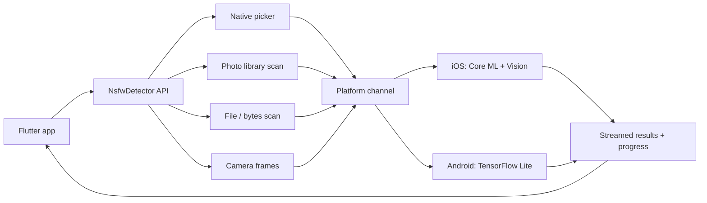
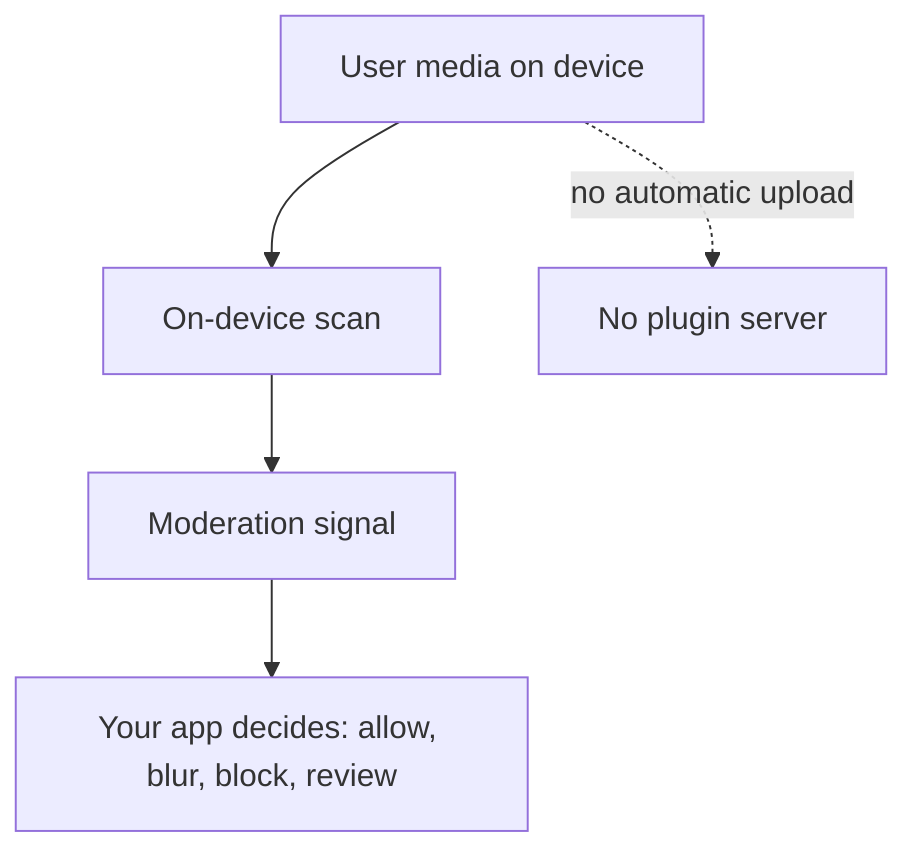

# nsfw_detect

[](https://pub.dev/packages/nsfw_detect)
[](https://pub.dev/packages/nsfw_detect/score)
[](https://pub.dev/packages/nsfw_detect)
[](https://pub.dev/packages/nsfw_detect)
[](LICENSE)

Privacy-friendly NSFW detection for Flutter apps, running fully on-device.

Use `nsfw_detect` to scan images, videos, selected media, photo libraries, and camera frames locally with Core ML on iOS and TensorFlow Lite on Android. No server upload is required by the plugin.

> Detection is probabilistic. Use it as a local moderation signal and one layer in a broader safety workflow.

## Why use this package?

Apps with user-generated content often need to check media before it is uploaded, displayed, shared, or indexed. `nsfw_detect` helps you run that first moderation pass on the user's device, which can reduce unnecessary uploads of private media and keep precheck workflows responsive.

It is a good fit for upload prechecks, chat attachments, social feeds, gallery apps, parental-control features, private media filtering, and local-first content moderation.

## Features

- On-device NSFW detection for Flutter apps
- Image, video, photo library, native picker, file, bytes, and camera scanning
- iOS support via Core ML and Vision
- Android support via TensorFlow Lite
- Stream-based scan results and progress updates
- Configurable confidence thresholds
- Classification categories: safe, suggestive, nudity, explicit nudity, unknown
- Optional detection mode with body-part bounding boxes
- Video frame sampling with configurable frame count and interval
- Incremental scan cache for large media libraries
- Ready-to-use widgets and headless Dart APIs
- No telemetry or automatic media upload by the plugin

## Use cases

- User-generated content apps
- Image and video upload prechecks
- Chat attachments and private messaging
- Social feeds and community apps
- Gallery and media management apps
- Parental-control features
- Private media filtering
- Local-first content moderation workflows

## Installation

```yaml
dependencies:
  nsfw_detect: ^2.1.1
```

Then run:

```bash
flutter pub get
```

## Platform requirements

| Platform | Minimum |
| --- | --- |
| iOS | 16.0+ |
| Android | API 24 / Android 7.0+ |
| Flutter | 3.22+ |
| Dart | 3.4+ |
| Xcode | 15+ |

## iOS setup

Add photo library permission text to your app's `Info.plist`:

```xml
<key>NSPhotoLibraryUsageDescription</key>
<string>This app checks selected media on-device before it is used.</string>
```

If you use `NsfwCameraView` or `startCameraScan`, also add:

```xml
<key>NSCameraUsageDescription</key>
<string>This app checks camera frames on-device.</string>
```

Ensure your app targets iOS 16 or higher:

```ruby
platform :ios, '16.0'
```

## Android setup

Add the permissions you need to `android/app/src/main/AndroidManifest.xml`:

```xml
<!-- Photo library, Android 13+ -->
<uses-permission android:name="android.permission.READ_MEDIA_IMAGES" />
<uses-permission android:name="android.permission.READ_MEDIA_VIDEO" />

<!-- Photo library, Android 12 and below -->
<uses-permission
  android:name="android.permission.READ_EXTERNAL_STORAGE"
  android:maxSdkVersion="32" />

<!-- Camera, only required for NsfwCameraView / startCameraScan -->
<uses-permission android:name="android.permission.CAMERA" />
<uses-feature android:name="android.hardware.camera" android:required="false" />
<uses-feature android:name="android.hardware.camera.autofocus" android:required="false" />
```

## Quickstart

```dart
import 'package:flutter/foundation.dart';
import 'package:nsfw_detect/nsfw_detect.dart';

final status = await NsfwDetector.instance.requestPermission();

if (status != PhotoLibraryPermissionStatus.authorized &&
    status != PhotoLibraryPermissionStatus.limited) {
  // Show your permission UI or fallback flow.
  return;
}

final session = await NsfwDetector.instance.startScan(
  const ScanConfiguration(
    confidenceThreshold: 0.75,
    includeVideos: true,
    maxVideoFrames: 8,
  ),
);

session.results.listen((result) {
  if (result.isNsfw) {
    debugPrint(
      '${result.item.localIdentifier}: '
      '${result.topCategory.displayName} '
      '${(result.topConfidence * 100).toStringAsFixed(1)}%',
    );
  }
});

session.progress.listen((progress) {
  debugPrint('${progress.scannedCount}/${progress.totalCount}');
});

final summary = await session.done;
debugPrint('Scanned ${summary.totalScanned} items.');
```

Cancel a running scan:

```dart
await session.cancel();
```

## Scan an image or video file

Use `scanFile` for media from an upload flow, document picker, app sandbox, share extension, or temporary file.

```dart
final result = await NsfwDetector.instance.scanFile(
  file.path,
  confidenceThreshold: 0.75,
);

if (result.isNsfw) {
  // Block, blur, review, or ask the user to choose another file.
}
```

## Scan image bytes

Use `scanBytes` for camera captures, generated images, downloaded images, or clipboard images represented as `Uint8List`.

```dart
final result = await NsfwDetector.instance.scanBytes(
  imageBytes,
  confidenceThreshold: 0.75,
);

debugPrint(result.topCategory.displayName);
```

## Scan selected media with the native picker

`pickAndScan` opens the system picker and scans only the selected items. Full photo-library permission is not required because the picker grants access to the selected media.

```dart
final session = await NsfwDetector.instance.pickAndScan(
  maxItems: 5,
  config: const ScanConfiguration(confidenceThreshold: 0.75),
);

session.results.listen((result) {
  debugPrint('${result.item.localIdentifier}: ${result.topCategory.displayName}');
});

final summary = await session.done;
debugPrint('Scanned ${summary.totalScanned}, flagged ${summary.nsfwCount}.');
```

If the user cancels the picker, `session.done` resolves with a zero-item summary.

## Pick media without scanning

Use `pickMedia` when you want to show your own preview UI before deciding what to scan.

```dart
final items = await NsfwDetector.instance.pickMedia(
  type: MediaPickerType.any,
  multiple: true,
  maxItems: 10,
);

for (final media in items) {
  final result = await NsfwDetector.instance.scanAsset(media.localId);
  debugPrint('${media.localId}: ${result.topCategory.displayName}');
}
```

## Scan a media library

`startScan` streams results and progress as the library is processed. Cached results can be replayed on later runs, which is useful for large galleries.

```dart
final session = await NsfwDetector.instance.startScan(
  const ScanConfiguration(
    confidenceThreshold: 0.7,
    includeVideos: true,
    includeLivePhotos: true,
    skipAlreadyScanned: true,
    replayCachedResults: true,
    concurrency: 4,
  ),
);

session.results.listen((result) {
  if (result.fromCache) {
    debugPrint('Cached: ${result.item.localIdentifier}');
  }
});

final summary = await session.done;
```

## Live camera scan

Use the drop-in camera widget when you want a native camera preview plus on-device scan results.

```dart
NsfwCameraView(
  config: const CameraConfiguration(
    fps: 2,
    mode: ScanMode.classification,
    confidenceThreshold: 0.75,
  ),
  showHudOverlay: true,
  enableBlurOnNsfw: true,
  onResult: (result) {
    if (result.isNsfw) {
      debugPrint('${result.topCategory.displayName}: ${result.topConfidence}');
    }
  },
  onPermissionDenied: () {
    // Show your own permission UI.
  },
);
```

For headless camera scanning:

```dart
final session = await NsfwDetector.instance.startCameraScan(
  const CameraConfiguration(fps: 4),
);

session.results.listen(
  (result) => debugPrint(result.topCategory.displayName),
  onError: (error) {
    if (error is CameraPermissionDeniedException) {
      // Prompt the user or show settings instructions.
    }
  },
);

await NsfwDetector.instance.stopCameraScan();
```

Only one camera session can run at a time.

## Configuration

Common configuration options:

```dart
const ScanConfiguration(
  modelId: ModelIds.openNsfw2,
  mode: ScanMode.classification,
  confidenceThreshold: 0.75,
  includeVideos: true,
  includeLivePhotos: true,
  maxVideoFrames: 8,
  videoFrameInterval: 2.0,
  concurrency: 4,
  skipAlreadyScanned: true,
  replayCachedResults: true,
);
```

Detection mode adds bounding boxes:

```dart
const ScanConfiguration(
  modelId: ModelIds.nudenet,
  mode: ScanMode.detection,
  detectionConfidenceThreshold: 0.25,
  iouThreshold: 0.45,
  confidenceThreshold: 0.75,
);
```

Platform tuning:

```dart
const ScanConfiguration(
  iosComputeUnits: IosComputeUnits.all,
  androidDelegate: AndroidDelegate.gpu,
);
```

GPU and NNAPI delegates can improve performance on some Android devices, but CPU is the safest default.

## Categories

| Category | `isNsfw` | Meaning |
| --- | --- | --- |
| `safe` | false | No concerning content detected |
| `suggestive` | false | Ambiguous or suggestive content |
| `nudity` | true | Nudity signal detected |
| `explicitNudity` | true | Explicit nudity signal detected |
| `unknown` | false | Classification failed or output could not be mapped |

```dart
debugPrint(result.topCategory.displayName);
debugPrint(result.topConfidence.toString());

final nudityConfidence = result.confidenceFor(NsfwCategory.nudity);

for (final label in result.labels) {
  debugPrint('${label.category.displayName}: ${label.confidence}');
}
```

## Models

The default model is `ModelIds.openNsfw2`. Additional models can be downloaded or preloaded depending on the workflow.

```dart
final models = await NsfwDetector.instance.availableModels();

for (final model in models) {
  debugPrint('${model.id}: ${model.displayName} available=${model.isAvailable}');
}

await NsfwDetector.instance.preloadModel(ModelIds.openNsfw2);
```

Download an optional model:

```dart
final ok = await NsfwDetector.instance.downloadModel(ModelIds.nudenet);
```

Use your own mirror when needed:

```dart
await NsfwDetector.instance.downloadModel(
  ModelIds.falconsai,
  url: 'https://your-cdn.example.com/FalconsaiNSFW.tflite.zip',
);
```

## Widgets

The package includes reusable widgets for common moderation UIs:

- `NsfwGalleryView`
- `NsfwCameraView`
- `NsfwPermissionsView`
- `NsfwResultBadge`
- `NsfwScanProgressBar`
- `NsfwDetectionOverlay`
- `NsfwScanControls`

Example gallery:

```dart
NsfwGalleryView(
  initialConfig: const ScanConfiguration(confidenceThreshold: 0.75),
  blurNsfwTiles: true,
  badgeStyle: BadgeStyle.compact,
  onResultTap: (result) {
    // Open your detail or review screen.
  },
  onScanComplete: (summary) {
    debugPrint('Flagged ${summary.nsfwCount} of ${summary.totalScanned}');
  },
);
```

Permission UI:

```dart
NsfwPermissionsView(
  onOpenSettings: () {
    // Open your app's settings page with your preferred package.
  },
  onPermissionChanged: (kind, status) {
    debugPrint('${kind.defaultLabel}: ${status.name}');
  },
);
```

## Privacy

`nsfw_detect` is designed for local-first media analysis.

- Inference runs on-device
- The plugin does not upload images, videos, thumbnails, or scan results
- The plugin does not include analytics or telemetry
- Streamed scan results are delivered to your app
- Picker-based scanning can avoid full photo-library permission

Your app is still responsible for explaining permissions, handling results, storing any moderation state, and complying with platform, privacy, and safety requirements.

## Limitations

NSFW detection is probabilistic. Results can include false positives and false negatives, especially with unusual lighting, partial visibility, illustrations, screenshots, low-resolution media, compressed videos, or ambiguous content.

Tune confidence thresholds for your product risk. For sensitive workflows, combine on-device detection with user reporting, human review, server-side checks, policy-specific rules, or other moderation layers.

Do not present detection output as a guarantee. Treat it as a moderation signal.

## Visual assets without explicit screenshots

Screenshots are difficult for this category of package. Prefer neutral assets that explain the workflow without showing explicit content:

- Architecture diagram
- API flow diagram
- Safe mock moderation UI with placeholder images
- Demo GIF using neutral test images
- Console log output
- "No upload required" privacy visual
- Before and after code snippets for upload prechecks

### On-device scan flow



### Privacy flow



### Neutral console demo

```text
Scanning selected media...
1/5 safe 0.98
2/5 safe 0.94
3/5 suggestive 0.41
4/5 review_required 0.78
5/5 safe 0.99
Done: 5 scanned, 1 flagged for review
```

## FAQ

### Does this upload media to a server?

No. The plugin runs inference on-device. Your app controls what happens before and after scanning.

### Is detection always correct?

No. ML classification is probabilistic. Treat results as moderation signals, not guarantees.

### Can I scan before uploading?

Yes. Use `scanFile`, `scanBytes`, `pickAndScan`, `pickMedia` plus `scanAsset`, or `startScan` before your upload pipeline.

### Does picker-based scanning need full photo-library access?

No. `pickAndScan` uses the native system picker and scans the items selected by the user.

### Does it support videos?

Yes. Videos are scanned by sampling frames according to `ScanConfiguration`.

### Does it support live camera scanning?

Yes. Use `NsfwCameraView` for a drop-in widget or `startCameraScan` for a headless stream.

### Which platforms are supported?

iOS and Android.

## Example app

Run the example app from the repository:

```bash
git clone https://github.com/nexas105/flutter_nsfw_scaner.git
cd flutter_nsfw_scaner/example
flutter pub get
flutter run
```

A real iOS or Android device is recommended for photo library and camera workflows.

## Package links

- [pub.dev package](https://pub.dev/packages/nsfw_detect)
- [API documentation](https://pub.dev/documentation/nsfw_detect/latest/)
- [GitHub repository](https://github.com/nexas105/flutter_nsfw_scaner)
- [Issue tracker](https://github.com/nexas105/flutter_nsfw_scaner/issues)
- [Changelog](CHANGELOG.md)

## Contributing

Contributions are welcome. Good areas to help:

- Documentation improvements
- Example app improvements
- iOS and Android device testing
- Permission-flow edge cases
- Performance profiling
- Model integration and validation

Before opening a pull request, run:

```bash
flutter test
dart format .
dart pub publish --dry-run
```

For larger changes, open an issue first so the API and platform impact can be discussed.

## Support and feedback

Use GitHub Issues for bugs, feature requests, documentation gaps, and platform-specific problems. Include Flutter version, device model, OS version, package version, and a minimal reproduction when possible.

## License

MIT. See [LICENSE](LICENSE).
